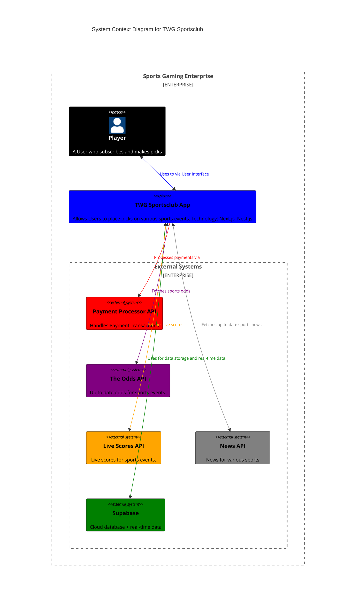

# Systems Context Diagram for TWG Sportsclub

```mermaid
  C4Context
    title System Context Diagram for TWG Sportsclub
    Enterprise_Boundary(b0, "Sports Gaming Enterprise") {
      Person(player, "Player", "A User who subscribes and makes picks")
      System(TWGSportsclubApp, "TWG Sportsclub App", "Allows Users to place picks on various sports events. Technology: Next.js, Nest.js ")

      Enterprise_Boundary(b1, "External Systems") {
        System_Ext(paymentProcessorAPI, "Payment Processor API", "Handles Payment Transactions")
        System_Ext(oddsAPI, "The Odds API", "Up to date odds for sports events.")
        System_Ext(liveScoresAPI, "Live Scores API", "Live scores for sports events.")
        System_Ext(newsAPI, "News API", "News for various sports")
        System_Ext(Supabase, "Supabase", "Cloud database + real-time data")
      }

    }

    BiRel(player, TWGSportsclubApp, "Uses to via User Interface")
    Rel(TWGSportsclubApp, paymentProcessorAPI, "Processes payments via")
    BiRel(TWGSportsclubApp, Supabase, "Uses for data storage and real-time data")
    BiRel(TWGSportsclubApp, oddsAPI, "Fetches sports odds")
    BiRel(TWGSportsclubApp, liveScoresAPI, "Fetches live scores")
    BiRel(TWGSportsclubApp, newsAPI, "Fetches up to date sports news")

    UpdateElementStyle(player, $fontColor="white", $bgColor="black", $borderColor="black")
    UpdateElementStyle(TWGSportsclubApp, $fontColor="black", $bgColor="blue", $borderColor="black")
    UpdateElementStyle(paymentProcessorAPI, $fontColor="black", $bgColor="red", $borderColor="black")
    UpdateElementStyle(Supabase, $fontColor="black", $bgColor="green", $borderColor="black")
    UpdateElementStyle(oddsAPI, $fontColor="black", $bgColor="purple", $borderColor="black")
    UpdateElementStyle(liveScoresAPI, $fontColor="black", $bgColor="orange", $borderColor="black")
    UpdateElementStyle(newsAPI, $fontColor="black", $bgColor="grey", $borderColor="black")

    UpdateRelStyle(player, TWGSportsclubApp, $textColor="blue", $lineColor="blue", $offsetX="5")
    UpdateRelStyle(TWGSportsclubApp, paymentProcessorAPI, $textColor="red", $lineColor="red", $offsetY="-10")
    UpdateRelStyle(TWGSportsclubApp, Supabase, $textColor="green", $lineColor="green", $offsetY="-10")
    UpdateRelStyle(TWGSportsclubApp, oddsAPI, $textColor="purple", $lineColor="purple", $offsetY="-10")
    UpdateRelStyle(TWGSportsclubApp, liveScoresAPI, $textColor="orange", $lineColor="orange", $offsetY="-10")
    UpdateRelStyle(TWGSportsclubApp, newsAPI, $textColor="grey", $lineColor="grey", $offsetY="-10")

    UpdateLayoutConfig($cShapeInRow="3")
```
